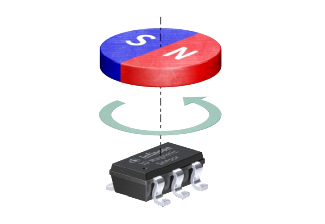
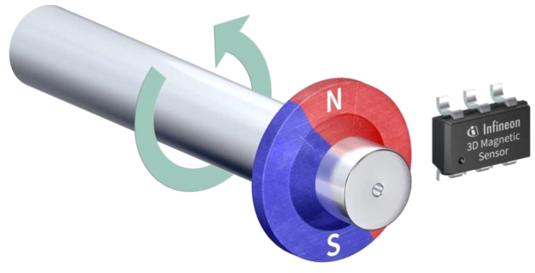
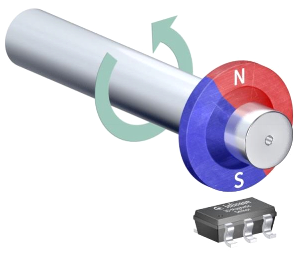
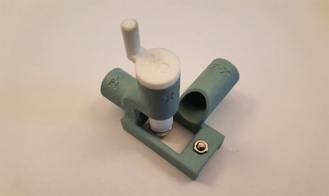
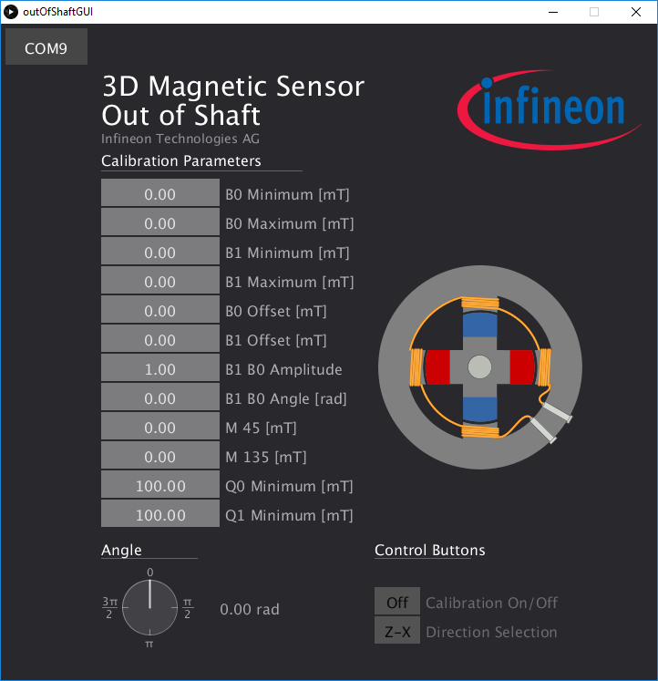
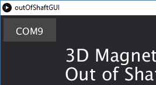
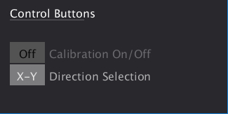
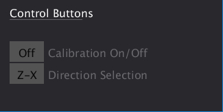

# Out of Shaft Example for TLx493D 3D Magnetic Sensor

## Introduction

In several applications, it is not possible to access the end of a shaft for an angle measurement as shown above.

An easy-to-use approach is to use a magnetic 3D sensor by measuring the X-Y (X-Z or Y-Z) components. The sensor is located out of the shaft as illustrated below.
The shaft needs to have a magnetic encoder with at least 2 poles on the shaft as shown here:

### X-Y Configuration

### Z-X Configuration

## Usage of this Example

### Hardware and Software

You can easily use this example with one of the two examples in the folders `exampleTLE493D_outOfShaft` and `exampleTLV493D_outOfShaft`. 
For more information about the supported boards, please consult the respective repositories of the different sensor variants:

For `exampleTLE493D_outOfShaft` please consult this repository: [TLE493D-3DMagnetic-Sensor](https://github.com/Infineon/TLE493D-3DMagnetic-Sensor).

For `exampleTLV493D_outOfShaft` please consult this repository: [TLV493D-A1B6-3DMagnetic-Sensor](https://github.com/Infineon/TLV493D-A1B6-3DMagnetic-Sensor)

Please note that you need to install the respective library for Arduino for the 3D Magnetic sensor.
More information can be found in the respective repository.

For this application, there exists a specific 3D printed tool as shown below.
You can get this directly from Infineon or from a distributor. 

Please flash one of the two examples depending on the respective board which you would like to use for the next step.

### Processing GUI

The folder `processing/outOfShaftGUI` contains the GUI for the out of shaft application as shown below:

In order to use the GUI, you need to download [Processing](https://processing.org/) from the webpage.
Just start Processing, open the `outOfShaftGUI.pde` example and press the run button (the arrow on top left).
Basic tutorials on how to use Processing can be found [here](https://processing.org/tutorials/).

Once started, please click on one `COM` port to connect to the respective serial output of the board:

Once connected, you will be able to switch between `X-Y` and `Z-X` using the button below in the GUI.
Additionally, you can disable the calibration of the values:

 

If you rotate now the handle of the tool, you will see the motor turning and the parameters will be updated.
Additionally, you get the output of the angle as shown in the GUI.

## Additional Information

There is a whole application note which comprises all the information needed for the out of shaft application. The application note can be found [here](https://www.infineon.com/dgdl/Infineon-Out_of_Shaft-AN-v01_00-EN.pdf?fileId=5546d46265257de801653898ba536074).

Additionally, you will also find more information about the TLx493D 3D Magnetic Sensor family and applications on the webpage [here](https://www.infineon.com/cms/en/product/promopages/sensors-2go/).